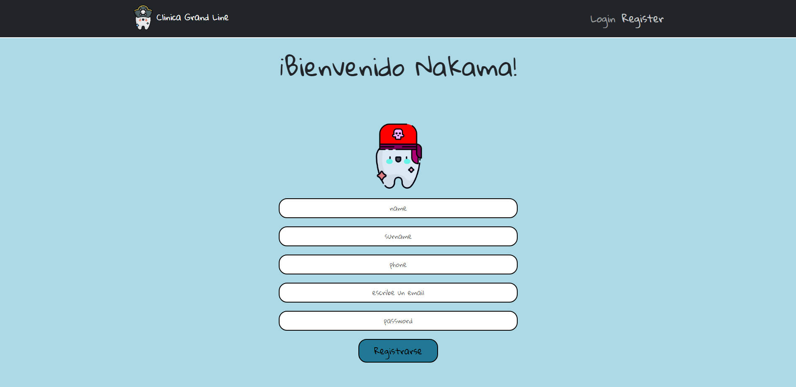
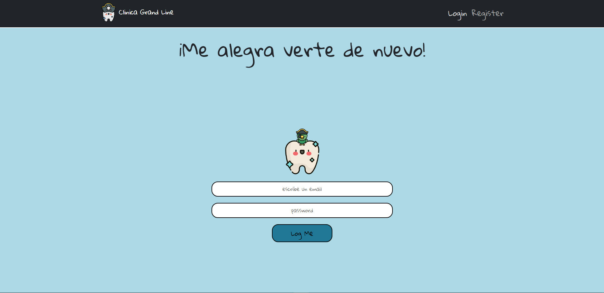
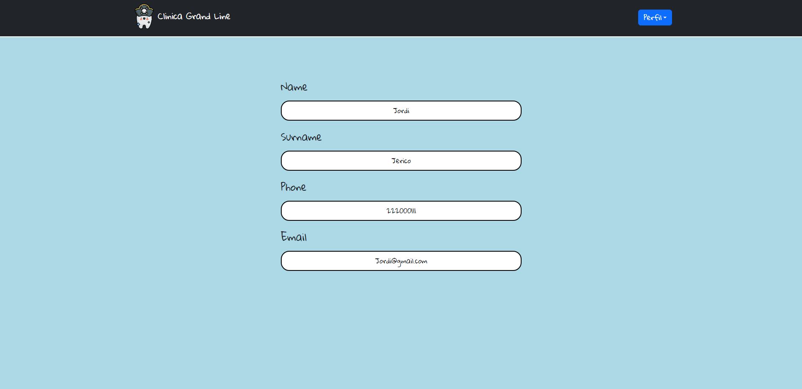
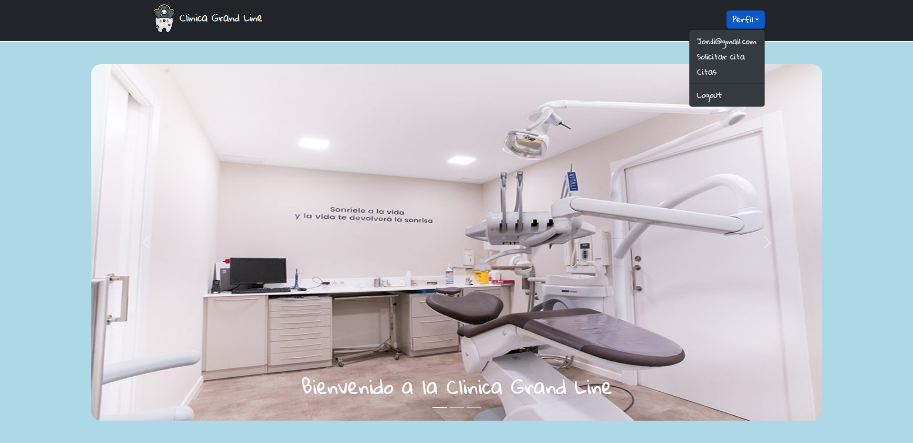
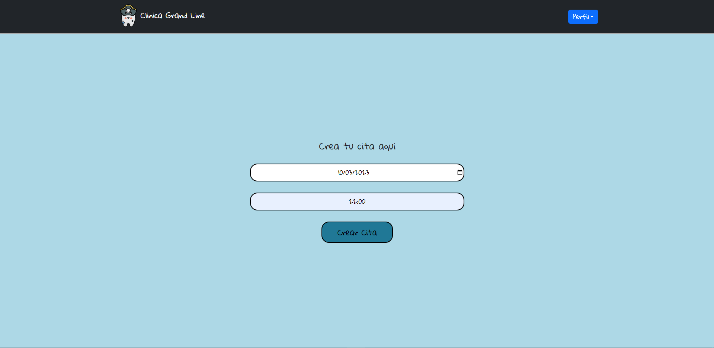
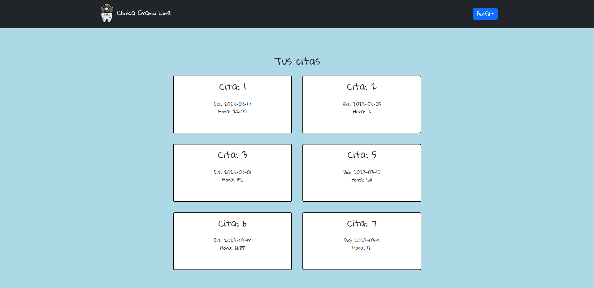

# Clínica Grand Line 

  
Contenido 

  <ol>
    <li><a href="#objetivo-🎯">Objetivo</a></li>
    <li><a href="#sobre-el-proyecto-🔎">Sobre el proyecto</a></li>
    <li><a href="#deploy-🚀">Deploy</a></li>
    <li><a href="#stack">Stack</a></li>
    <li><a href="#vistas">Vistas</a></li>
    <li><a href="#licencia">License</a></li>
    <li><a href="#agradecimientos">Agradecimientos</a></li>
    <li><a href="#contacto">Contacto</a></li>
  </ol>

## Objetivo 🎯 
En este proyecto se nos pedia hacer un frontend conectado mediante axios a nuestro anterior proyecto del <a href="https://github.com/Marcos1326/Backend-Clinica-Dental">backend de la clinica dental</a>

## Sobre el proyecto 🔎 
Seguimos trabajando creando nuestra aplicación web de Consultorio Dental. Trabajé para que todos esos puntos finales que trabajamos en el backend funcionaran perfectamente en el frontend. Para ello necesitaba que la web permitiera a los usuarios registrarse, iniciar sesión, reservar citas... etc. Y acceder a la web con diferentes roles: médico, paciente y administrador.
El proyecto aún se encuentra en periodo de desarrollo.

## Deploy 🚀 

    <a href="https://clinica.d8nnbcil63dk6.amplifyapp.com/"><strong>Url Deploy Clinica Grand Line</strong></a>🚀

## Vistas
<table>
    <tr>
        <td>
            
        </td>
        <td>
            
        </td>
    </tr>
    <tr>
        <td>
            
        </td>
        <td>
            
        </td>
    </tr>
    <tr>
        <td>
            
        </td>
        <td>
            
        </td>
    </tr>
</table>

## Stack

## License
Este proyecto ha sido creado bajo una Licencia MIT. Para obtener más información sobre los detalles, vaya a LICENSE.md.

## Agradecimientos:

Quiero agradecer a mis mentores de GeekHub por todo el apoyo que nos han brindado todos los días:
- **Dani**  
 

- **Jose**  
 

- **David**  

- ***Mara***  
 

## Contacto

No dude en ponerse en contacto conmigo en cualquier momento, para ayudarlo con su proyecto con React o para darme su opinión.

 

